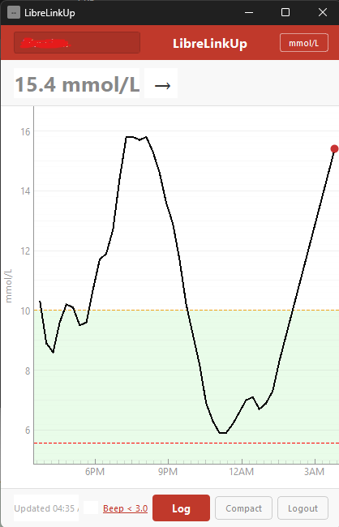

# LibreLinkUp Desktop v1.0.9

A Windows desktop app that replicates Abbott's [LibreLinkUp](https://www.librelinkup.com/) Android app, letting you monitor FreeStyle Libre CGM glucose readings directly on your PC -- no Android emulator needed.



## Features

- **Real-time glucose monitoring** -- auto-refreshes every 60 seconds (configurable) with trend arrows (rising, falling, stable, etc.)
- **Auto-login** -- skips the login screen when credentials are cached and "Remember credentials" is enabled
- **12-hour glucose chart** -- interactive graph with target range band (green shading), low/high alarm lines, and a red dot for the current reading
- **Higher-resolution chart data** -- accumulates 1-minute readings locally to fill the API's 15-minute graph gaps
- **Dynamic taskbar icon** -- displays the current glucose number with a 4-tier color scheme based on mmol/L range: red background with yellow text (below 4), green background with black text (4–10), yellow background with black text (10.1–14.9), dark red background with white text (15+), grey with "--" when stale
- **Auto-update** -- on launch, automatically checks GitHub for a newer release and silently updates in the background; manual "Check for Updates..." also available in the gear menu
- **Gear menu (⚙)** -- single menu for compact/full view toggle, keep on top, low glucose beep settings, check for updates, and logout
- **Compact view** -- minimal window showing only the glucose number and trend arrow; toggle via gear menu or the "expand" button
- **Always on top** -- pin the window above all other applications; persisted between sessions
- **Low glucose warning beep** -- audible 1000 Hz alert when glucose drops below a configurable threshold (default 4.0 mmol/L)
- **Stale data detection** -- when the last reading is older than the configured threshold, the display alternates between the last value and "No Recent Data" every 800ms
- **Logbook viewer** -- table dialog showing manual scan history with timestamps and glucose values
- **Encrypted credentials** -- email and password stored locally using Fernet encryption, keyed to your Windows username and machine name
- **Window position** -- saved on close and restored on next launch; centers on screen when no saved position exists or when expanding from compact to full view
- **mmol/L and mg/dL** -- toggle units in real-time from the header bar; affects the display, chart, taskbar icon, and beep threshold
- **Multi-region support** -- US, Canada, EU, Germany, France, Australia, Japan, and Global (with automatic region redirect)
- **Multiple connections** -- switch between linked patients via a dropdown in the header bar
- **Version display** -- shown in window titles by default; can be hidden with the `hide_version` config key

## Quick Start

### Option 1: Download pre-built

Download `LibreLinkUp.zip` from the [`bin`](bin/) folder, extract it anywhere, and run `LibreLinkUp.exe`. No Python installation required.

### Option 2: Run from source

```bash
pip install -r requirements.txt
python main.py
```

### Option 3: Build a standalone .exe

```bash
pip install -r requirements.txt
build.bat
```

This builds the app and packages it into `bin/LibreLinkUp.zip`.

## Configuration

Edit `config.json` (next to `main.py` or `LibreLinkUp.exe`). All settings are optional -- missing keys use their defaults.

```json
{
  "region": "Canada",
  "unit": "mmol",
  "target_low_mmol": 3.9,
  "target_high_mmol": 10.0,
  "refresh_seconds": 60,
  "stale_minutes": 15,
  "low_beep_enabled": true,
  "low_beep_threshold_mmol": 4.0,
  "compact_view": false,
  "always_on_top": false,
  "remember_credentials": false
}
```

| Setting | Default | Description |
|---------|---------|-------------|
| `region` | `"Canada"` | API region: US, Canada, EU, Germany, France, Australia, Japan, Global |
| `unit` | `"mmol"` | Display unit: `"mmol"` or `"mgdl"` |
| `target_low_mmol` | `3.9` | Lower bound of the target range band on the chart (mmol/L) |
| `target_high_mmol` | `10.0` | Upper bound of the target range band on the chart (mmol/L) |
| `refresh_seconds` | `60` | How often to poll the API (seconds) |
| `stale_minutes` | `15` | Minutes before a reading is considered stale and triggers blinking |
| `low_beep_enabled` | `true` | Enable/disable the low glucose warning beep |
| `low_beep_threshold_mmol` | `4.0` | Beep when glucose is below this value (mmol/L); also configurable via gear menu |
| `compact_view` | `false` | Start in compact mode (number + trend only); toggled via gear menu |
| `always_on_top` | `false` | Keep the window above other applications; toggled via gear menu |
| `remember_credentials` | `false` | Save encrypted login credentials for auto-login on next launch |

### Hidden Settings

These settings are not exposed in the UI. Add them manually to `config.json` if needed.

| Setting | Default | Description |
|---------|---------|-------------|
| `prevent_sleep` | `true` | Prevent screensaver and display sleep while the app is running |
| `hide_version` | `false` | Hide the version number from window titles |
| `window_x` | — | Saved window X position (set automatically on close) |
| `window_y` | — | Saved window Y position (set automatically on close) |

## Requirements

- Windows 10/11
- A [LibreLinkUp](https://www.librelinkup.com/) account with an active connection to a FreeStyle Libre sensor
- Python 3.10+ (only if running from source)

## How It Works

This app uses the unofficial LibreLinkUp API (the same one Abbott's Android app uses) to fetch glucose data. It requires your LibreLinkUp email and password to authenticate.

**Important:** This is an unofficial project. It is not affiliated with or endorsed by Abbott. The API may change at any time.

## License

MIT
